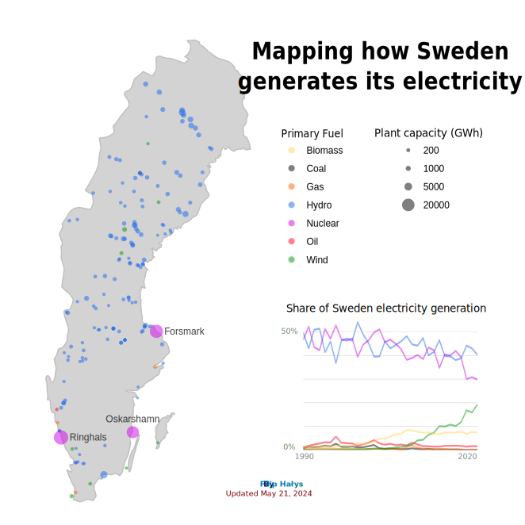

## Mapping how Sweden generates its electricity

Data sourced from the websites: 
- https://datasets.wri.org/dataset/globalpowerplantdatabase
- https://ourworldindata.org/grapher/electricity-prod-source-stacked

Data has been processed and analyzed using the R language. The map, legend, chart, and other elements were combined using the vector graphics editor Inkscape.

The following link contains a map template that served as inspiration.
- https://www.washingtonpost.com/graphics/national/power-plants/

Here You can see [Layout](https://github.com/filiphalys02/Mapping-how-Sweden-generates-its-electricity/blob/main/layout2.svg) (The layout file is in SVG format. If you are using GitHub's dark mode, the content of the file may blend with the background.):

